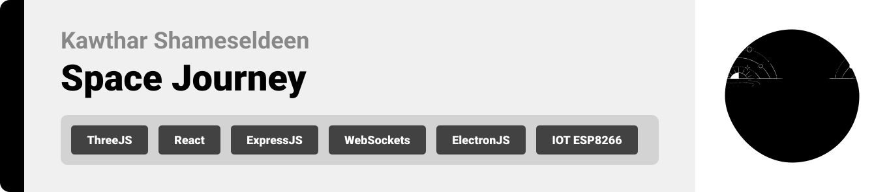
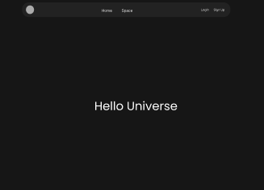
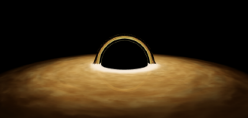

<br><br>

<!-- project philosophy -->


> Space Journey aims to educate and inspire by offering an interactive and immersive platform for users to explore the universe. We believe in making space education engaging and accessible, enhancing the learning experience through cutting-edge 3D visualization and real-time interactivity.
>
> Our platform integrates IoT technology to provide dynamic lighting effects during the tour, creating an even more realistic and captivating space journey.

### User Stories

### User:

- As a user, I want to explore the 3D space tour, so I can learn about the universe in an interactive and immersive way.
- As a user , I want to view many 3D scenes , Milkyway , Solar System , Black Hole , Nebula
- As a user, I want to experience dynamic lighting effects during the tour, so I can have a realistic and captivating journey through space.

### Admin:

- As an admin, I want to view a list of all registered users on desktop app
- As an admin , I want to view a list of all deivces on desktop app
- As an admin , I want to view the connected pins in the ESP8266 on desktop app
  <br><br>

<!-- Tech stack -->


> 3D Space Tour with IoT Integration is built using the following technologies:

- [React](https://react.dev/) & [Three.js](https://threejs.org/): The frontend is built with React and Three.js to create an interactive and dynamic 3D space tour, allowing users to explore the environment.

- [ElectronJS](https://www.electronjs.org/) : The admin panel is built with ElectronJS and React to create desktop app

- [Node.js](https://nodejs.org/en), [Express](https://expressjs.com/) & [MongoDB](https://www.mongodb.com/docs/): The backend uses Node.js and Express.js for server-side logic, with MongoDB as the database to manage data and support real-time operations.

- [ESP8266](https://arduino-esp8266.readthedocs.io/en/latest/) & IoT: IoT integration is powered by the ESP8266, enabling the app to control physical devices (like lights) based on user interactions with the 3D tour.

- [Socket.io](https://socket.io/): Ensures real-time communication between the frontend and IoT devices, allowing seamless updates and synchronization.

- The app uses the font: "Popins" as the main font for the UI design.

<br><br>

<!-- UI UX -->


> We designed the 3D Space Tour with IoT integration using wireframes and mockups, iterating on the design to ensure an immersive and user-friendly experience for exploring the space environment.

- Project Figma design [figma](https://www.figma.com/design/x3ik1gHkx6FZ9RbfEOqSrH/Space-Journey?node-id=0-1&t=3nPedjzeBdMIpC4X-1)

### Mockups

| Home Screen                               | BlackHole Screen                            |
| ----------------------------------------- | ------------------------------------------- |
|  |  |

<br><br>

<!-- Database Design -->


### Architecting Data Excellence: Innovative Database Design Strategies:

- 

<br><br>

<!-- Implementation -->


### User Screens (Web)

| Landing Screen   | SolarSystem Screen |
| ---| ---| 
|   |  | 

| BlackHole Screen  | Nebula Screen |
| ---| ---| 
|   |  | 


### Admin Screens (Desktop)

| Users Screen  | Devices Screen |
| ---| ---| 
|  |  | 


<br><br>

<!-- Prompt Engineering -->


### Mastering IoT and 3D Interaction: Enhancing User Experience:

- This project uses advanced techniques to optimize interaction with the 3D environment and IoT devices. By creating well-structured control prompts and interactions, users can seamlessly navigate the 3D space, adjust elements like lighting, and interact with IoT devices. The design focuses on intuitive and responsive control to ensure smooth synchronization between the 3D tour and the connected IoT components, enhancing the overall immersive experience.

<br><br>

<!-- AWS Deployment -->


### Efficient Backend Deployment: Unleashing the Power of AWS Integration:

- This project uses AWS to deploy the backend Node.js server, ensuring scalability, reliability, and performance. The backend is hosted on an AWS EC2 instance, providing a stable environment to handle API requests, manage real-time communication with IoT devices, and serve data to the 3D space tour. With AWS services like S3 for storage and CloudWatch for monitoring, we ensure that the backend performs optimally under various workloads.

| Login                            | Register                            |
| ----------------------------------------- | ------------------------------------------- |
|  |  |
<br><br>

<!-- Unit Testing -->


### Precision in Development: Harnessing the Power of Unit Testing:

- This project implements thorough unit testing to ensure the reliability and functionality of both the backend Node.js server and the IoT interactions. By testing individual components such as API routes, real-time communication through Socket.io, and IoT device control, we can catch and resolve potential issues early. This guarantees that each part of the system works as expected, providing a strong and stable foundation for the 3D space tour and IoT integration.


<br><br>

<!-- How to run -->


> To set up Space-Journey locally, follow these steps:

1. Clone the repository:

```sh
https://github.com/kawthar-shameseldeen/Space-Journey-.git
```

2. Navigate to the project directory and install NPM packages:

```sh
#Install for website
cd Space-Journey-Front
cd space-journey
npm install npm@latest -g
#open new terminal
# Install for desktop
cd Space-Journey-Front
cd admin
npm install npm@latest -g
cd desktop
npm install npm@latest -g
```

3. Run the website:

# Build for Webiste

```sh
cd Space-Journey-Front
cd space-journey
npm run start
```

4. Run the desktop:

# Build for Desktop

```sh
cd Space-Journey-Front
cd admin
npm  start
#Login as admin
#email : desktop@email.com
#password: desktop@desktop
```

Now, you should be able to run Space Journey locally and explore its features.
